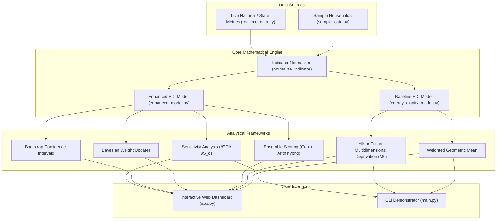

# 🇮🇳 Energy Dignity Index (EDI) Platform

[]()
[]()
[]()
[]()

The **Energy Dignity Index (EDI) Platform** is a multi-dimensional, analytical framework and real-time intelligence dashboard tailored for evaluating energy access and household flourishing in India. 

Rather than treating energy access as a binary grid connection metric, this platform implements **Amartya Sen's Capability Approach** to measure *energy dignity*—capturing the real freedom of Indian countrymen to realize essential functionings (e.g., studying, clean cooking, running a livelihood) and exercise agency over their energy needs.

---

## 🗺️ Architectural Flow

The diagram below illustrates how raw household indicators and real-time national power grid metrics are normalized, aggregated through the mathematical models, and visualized on the user interfaces:



---

## 📐 Mathematical Formulation

### 1. Dimension Score ($S_{h,d}$)
For each household $h$ and dimension $d$, the score is computed as a weighted linear combination of normalized indicators:
$$S_{h,d} = \sum_{i=1}^{n_d} \omega_{d,i} \cdot x_{h,d,i}$$
where $x_{h,d,i} \in [0, 1]$ are the normalized indicators and $\omega_{d,i}$ are the intra-dimension indicator weights ($\sum_i \omega_{d,i} = 1$).

### 2. Multi-Dimensional Aggregation (EDI)
The baseline index uses a **weighted geometric mean** to prevent perfect substitutability between different capabilities:
$$EDI_h = \prod_{d \in \mathcal{D}} (S_{h,d})^{w_d}$$
where $\mathcal{D} = \{A, E, R, H, P, G\}$ is the set of dimensions, and $w_d$ are the dimension-level weights. If any dimension score is $0$ (complete deprivation), the overall $EDI_h = 0$.

### 3. Ensemble Aggregation (Enhanced Model)
The enhanced model incorporates an adaptive hybrid ensemble metric ($\alpha = 0.70$) blending the geometric mean with an arithmetic mean to allow for low-score recovery in near-boundary cases:
$$EDI_{ensemble} = \alpha \cdot \prod_{d} (S_{h,d})^{w_d} + (1 - \alpha) \cdot \sum_{d} w_d \cdot S_{h,d}$$

---

## 🗂️ Core Dimensions & Indicators

The index is constructed across **six dimensions** representing essential capabilities for human flourishing:

| Dimension | Symbol | Weight | Indicators |
| :--- | :---: | :---: | :--- |
| **Basic Access** | $A$ | 20% - 22% | Physical connection status ($A1$), Clean cooking fuel ($A2$), Lighting adequacy ($A3$) |
| **Economic Affordability** | $E$ | 20% | Expenditure ratio ($E1$), PMUY refill rate ($E2$), Bill payment ease ($E3$) |
| **Reliability & Quality** | $R$ | 15% | Outage frequency ($R1$), Hours of supply ($R2$), Voltage stability ($R3$) |
| **Health & Environment** | $H$ | 15% - 18% | Cooking location ($H1$), Fuel cleanliness ladder ($H2$), Indoor air quality ($H3$) |
| **Productive Use** | $P$ | 13% - 15% | Appliance ownership ($P1$), Study lighting ($P2$), Livelihood income energy ($P3$) |
| **Agency & Empowerment** | $G$ | 12% - 15% | Fuel choice freedom ($G1$), Billing transparency ($G2$), Grievance redressal ($G3$), Decision participation ($G4$) |

---

## 📂 Codebase Structure

The platform is modularized into the following components:

### Interfaces & Demonstrators
*   [app.py](file:///Users/shubham/Documents/countryman/app.py) - Streamlit-based live analytical intelligence dashboard. Contains modern dark-themed interactive visualizations including 3D surfaces, radar profiles, live generation donut charts, historical trajectory graphs, and correlation heatmaps.
*   [main.py](file:///Users/shubham/Documents/countryman/main.py) - Console-based execution script for household simulations, regional gap analysis, and policy impact testing.

### Modeling Engines
*   [energy_dignity_model.py](file:///Users/shubham/Documents/countryman/energy_dignity_model.py) - Baseline mathematical model featuring indicator normalization, Alkire-Foster headcount ratio ($M_0$), headcount ratio ($H$), and intensity of deprivation ($I$).
*   [enhanced_model.py](file:///Users/shubham/Documents/countryman/enhanced_model.py) - Production-grade mathematical model introducing bootstrap confidence intervals, Bayesian weight updates, sensitivity analysis (numerical derivatives), vulnerability classification, and multi-scenario trend projections.
*   [dynamic_model.py](file:///Users/shubham/Documents/countryman/dynamic_model.py) - Time-indexed dynamic model computations for historical transitions.

### Data & Resources
*   [realtime_data.py](file:///Users/shubham/Documents/countryman/realtime_data.py) - Real-time metrics simulator (POSOCO grid demand, solar generation curves, tariff structures, and national policy timeline updates).
*   [sample_data.py](file:///Users/shubham/Documents/countryman/sample_data.py) - Predefined survey data profiles representing typical urban/rural Indian households.
*   [data_loader.py](file:///Users/shubham/Documents/countryman/data_loader.py) - Dataset loader and parser.
*   [ENERGY_DIGNITY_MODEL.md](file:///Users/shubham/Documents/countryman/ENERGY_DIGNITY_MODEL.md) - Theoretical specification detailing baseline cutoffs, empirical mappings, and references.

---

## 🛠️ Installation & Setup

### Prerequisites
*   Python 3.9 or higher
*   pip package manager

### 1. Clone the Repository
```bash
git clone https://github.com/shubhamsharma0707/countryMan.git
cd countryman
```

### 2. Set Up Virtual Environment
Create and activate a virtual environment to manage dependencies:
```bash
# macOS/Linux
python3 -m venv venv
source venv/bin/activate

# Windows
python -m venv venv
venv\Scripts\activate
```

### 3. Install Dependencies
Install the required packages declared in [requirements.txt](file:///Users/shubham/Documents/countryman/requirements.txt):
```bash
pip install -r requirements.txt
```

---

## 🚀 Running the Platform

### Option A: Interactive Dashboard (Streamlit)
Launch the premium web UI to adjust weights, examine state correlations, project trajectories, and visualize the 3D Nexus:
```bash
streamlit run app.py
```
*The dashboard will automatically open in your browser at `http://localhost:8501`.*

### Option B: Command-Line Interface (CLI)
Run the analytical framework CLI to output individual household reports, regional stats, Alkire-Foster multi-dimensional rankings, and marginal impact policies:
```bash
python main.py
```

---

## 📊 Sample Output (CLI Demonstrator)

Running `python main.py` triggers:
1.  **Individual Household Analysis**: Evaluates specific households showing dimension breakdowns and deprivation scores.
2.  **Regional Analysis**: Compares Urban-Rural mean EDI values and maps the geographical gap.
3.  **Alkire-Foster Multidimensional Assessment**: Computes adjusted headcount ($M_0$) for the population based on a dual-cutoff ($k = 0.333$).
4.  **Dimensional Deficiency Contribution**: Pinpoints exactly which capabilities are dragging down overall energy dignity.
5.  **Marginal Impact Analysis**: Calculates potential EDI gain per unit improvement for optimal policy targeting.

---

## 📚 References
*   Sen, A. (1999). *Development as Freedom*. Oxford University Press.
*   Alkire, S., & Foster, J. (2011). Counting and multidimensional poverty measurement. *Journal of Public Economics*.
*   Nussbaumer, P., et al. (2012). Measuring energy poverty: Focusing on what matters. *Renewable and Sustainable Energy Reviews*.
